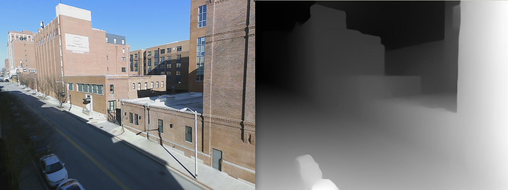

# ROS frontend for Intel-ISL MiDaS

ROS frontend for Intel-ISL MiDaS adapted from https://github.com/intel-isl/MiDaS

## Installation

Clone this repo to your ```~/catkin_ws/src``` folder, download the latest Intel MiDaS model (https://github.com/intel-isl/MiDaS/releases/download/v2_1/model-f6b98070.pt) to ```~/catkin_ws/src/intelisl_midas_ros/src```, go to ```~/catkin_ws/``` and compile the package using ```catkin_make```.

## Usage

```roslaunch intelisl_midas_ros midas.launch image:=<YOUR RGB TOPIC NAME>```, for example, ```roslaunch intelisl_midas_ros midas.launch image:=/usb_cam/image_raw```

## Expected Results



This package will publish three topics:

1. ```/midas/camera_info```: camera info of your RGB topic.
2. ```/midas/depth/image_raw```: depth images generated by Intel MiDaS based on your RGB topic.
3. ```/midas/rgb/image_raw```: your RGB topic, now delayed so it is synchronized with the depth topic.
